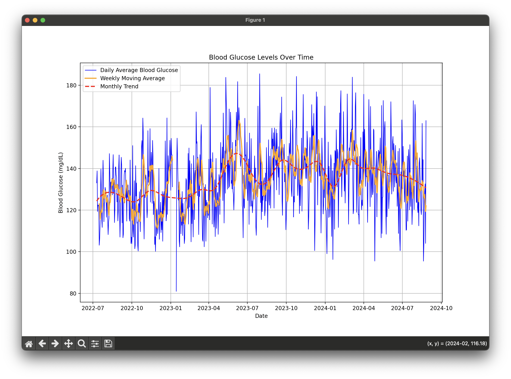

# Blood Glucose Trendline Plotter

This Python script reads blood glucose data from a CSV file downloaded from LibreView and generates a visual representation of blood glucose trends over time. It is designed to help users understand their blood glucose levels and identify patterns and trends, which can be valuable for diabetes management.

## Features

- **CSV File Reading**: Reads blood glucose data from a CSV file exported from a device.  
- **Data Cleaning**: Handles missing or non-numeric values and removes outliers using the Interquartile Range (IQR) method.  
- **Data Processing**: Combines multiple columns of glucose data into a single column, calculates daily averages, weekly moving averages, and monthly trends.  
- **Visualization**: Generates a plot that includes daily averages, weekly moving averages, and a smoothed monthly trend using cubic spline interpolation.  
- **User Interaction**: Uses a simple GUI to allow users to select the CSV file interactively.  
- **Error Handling**: Gracefully handles common errors such as file not found, incorrect format, and insufficient data for trend calculation.

## Prerequisites

Make sure you have Python installed along with the following libraries:

- `pandas`  
- `numpy`  
- `matplotlib`  
- `scipy`  
- `tkinter` (comes pre-installed with Python on most systems)

You can install the required libraries using pip:

```bash
pip3 install pandas numpy matplotlib scipy
```

## Usage

1. **Clone the Repository**: Clone the repository to your local machine.

2. **Run the Script**: Execute the Python script to start the application.

```bash
python3 glucose_graph.py  
```

3. **Select a CSV File**: A file dialog will open, allowing you to select your blood glucose data CSV file.

4. **View the Plot**: After selecting the file, the script will process the data and display a plot showing your blood glucose trends over time.

## CSV File Structure

The CSV file should have the following columns:

- `Gerät`: Device type  
- `Seriennummer`: Device serial number  
- `Gerätezeitstempel`: Device timestamp (datetime format)  
- `Aufzeichnungstyp`: Record type  
- `Glukosewert-Verlauf mg/dL`: Blood glucose level (mg/dL) - historical values  
- `Glukose-Scan mg/dL`: Blood glucose level (mg/dL) - scan values

Ensure that your CSV file format matches this structure for the script to function correctly.

### Example CSV Content

```
Glukose-Werte,Erstellt am,26-08-2024 16:21 UTC,Erstellt von,Jon Doe  
Gerät,Seriennummer,Gerätezeitstempel,Aufzeichnungstyp,Glukosewert-Verlauf mg/dL,Glukose-Scan mg/dL, ...  
FreeStyle Libre 3,5114DD15-F167-41AB-B12A-801E1604ED20,10-07-2022 00:01,0,126,, ...  
FreeStyle Libre 3,5114DD15-F167-41AB-B12A-801E1604ED20,10-07-2022 00:06,0,124,, ...  
```

## Error Handling

The script includes error handling for common issues such as:

- **File Not Found**: If the user cancels the file dialog or selects an invalid file.  
- **Incorrect Format**: If the CSV file does not match the expected format.  
- **Insufficient Data**: If there is not enough data to calculate trends.

## Contributing

Contributions are welcome! Please open an issue or submit a pull request with any changes or improvements.
## Example



## License

This project is licensed under the MIT License.

